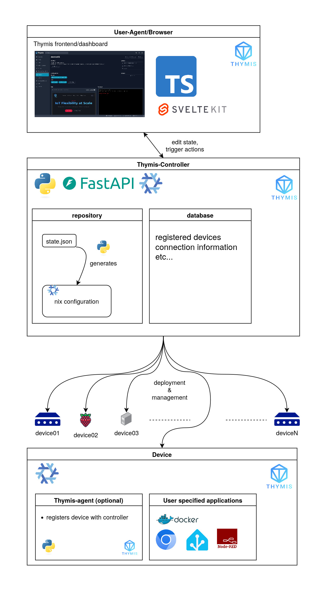

<p align="center">
<a href="https://thymis.io">
  
</a>
</p>
<p>
    <a href="https://thymis.io">
    <h1>THYMIS</h1>
    </a>
</p>
<p>
    <em>Quickly provision, configure, and manage devices using NixOS.</em>
</p>
<p>
	
	
    
    
    
</p>

Thymis is an open-source platform designed for managing and configuring IoT devices. Built on the robust NixOS operating system, Thymis ensures consistency, reliability, and ease of management across diverse IoT landscapes. Whether you're managing a few devices or a large-scale deployment, Thymis provides the tools needed to streamline your operations.

---

## Screenshot & Demo

||
|-|
|Screenshot of the Control Panel|

|<video src="https://github.com/user-attachments/assets/c4f240d8-8fde-4987-989d-c598d4cba487" width="300" />|
|-|
|Video of a Kiosk Deployment to 3 Devices changing the URL to [https://thymis.io/](https://thymis.io/)

##  Overview

Key features of Thymis include:

- **Device Provisioning**: Easily provision new devices with pre-configured system images.
- **Device Configuration**: Configure devices using a web-based interface.
- **Device Management**: Monitor device status, manage device modules, and deploy updated configurations to devices.
- **REST API**: Expose a REST API for CRUD operations on device and configuration data.
- **[NixOS](https://nixos.org/) Integration**: Leverage the power of NixOS for declarative system configuration.
    - **[nixpkgs](https://github.com/NixOS/nixpkgs)**: According to [Repology](https://repology.org/repositories/statistics/newest), nixpkgs has over 60000 packages with the latest version available. This makes it the largest collection of up-to-date software packages available for any Linux distribution. You can use any of these packages in your Thymis project.
    - Deployments without wasted bandwidth: Only changed paths are sent to the device, reducing the amount of data sent over the network.
    - Deployments without downtime: The device is updated atomically, ensuring that the device is always in a consistent state.
    - Rollbacks: If the device fails to boot after an update, the device can be rolled back to the previous state.
    - Reproducible builds: The same configuration will always produce the same result, ensuring that the device is always in a consistent state.
    - Air-gapped deployments: Devices can be updated without needing to connect to the internet. Only a connection to the Thymis controller is required. Deployments using Mass Storage is possible but not yet implemented.
- **Device tagging**: Tag devices to group them together for easier management.

---

## Architecture

The project uses SvelteKit for the frontend and FastAPI for a device controller. The frontend communicates with the controller using a REST API. The controller is responsible for managing device and module data.



## Getting Started

See the [Getting Started](https://docs.thymis.io/getting_started) guide in the documentation for detailed instructions on setting up Thymis.

## Documentation

The documentation is available at [docs.thymis.io](https://docs.thymis.io), built from the `docs` directory in the repository.


---

## Getting Started (Development)

***Requirements***

Ensure you have the following dependencies installed on your system:

* **Nix** (with Flakes support)


###  Installation

1. Clone the thymis repository:

```sh
git clone https://github.com/Thymis-io/thymis
```

2. Change to the project directory:

```sh
cd thymis
```

3. Enter an environment with the required dependencies:

```sh
nix develop
```

4. Install the frontend and controller dependencies:

```sh
cd frontend
npm install
cd ../controller
poetry install
```

###  Running `thymis`

Use the following command to run thymis:

```sh
cd controller
poetry run uvicorn thymis_controller.main:app --reload
```

The controller takes care of running the frontend for you. You can access thymis at `http://localhost:8000`.

---

## Project Roadmap

- [ ] `Release 0.1.0`: Initial release of the project.


---

## License

This project is protected under the [GNU Affero General Public License v3.0](https://choosealicense.com/licenses/agpl-3.0/) License. For more details, refer to the [LICENSE](./LICENSE) file.

---

## Acknowledgments

We love using these technologies and tools:

- [NixOS](https://nixos.org/)
- [Svelte](https://svelte.dev/)
- [FastAPI](https://fastapi.tiangolo.com/)
- [Python](https://www.python.org/)
- [Node.js](https://nodejs.org/)
